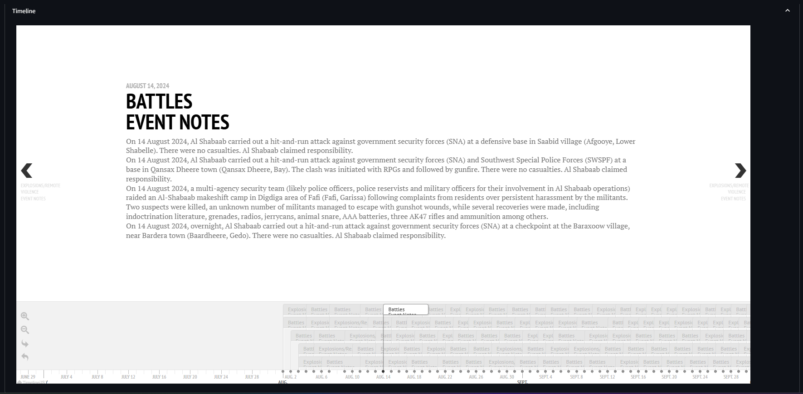

# Build Your Own Dashboard

- [Introduction](#introduction)
- [Features](#features)
- [Usage](#usage)
- [Documentation](#documentation)
- [What Happens if](#what-happens-if)

## Introduction

Build Your Own Dashboard is a data visualization and analysis tool for CEM (i.e., Cellex), ACLED, and GDELT data. It overlays data events and points on a map based on geospatial attributes.

BYOD aims to both streamline data integration to provide a comprehensive situational picture and enhance analytical capabilites by generating analytical plots.

## Getting Started

### Start the Application

Run the following command to build and start the containers:  

```docker-compose up```

## Workflow Diagram


## Features

<li>Map visualization
<li>Count Distribution
<li>Values Distribution
<li>Timeline Analysis
<li>Data View and Export

## Usage

### File Upload


### Data Filtering


### **_Build Your Own Dashboard!_**





# Documentation

BYOD is built with an object oriented programming approach where each classe has a unique and well defined purposes making it simple for future developers to adjust/remove pre-existing components and add new components.

- [Data Interaction Classes](#data-interaction-classes)
- [Visualization and Plotting Classes](#visualization-and-plotting-classes)

## Data Interaction Classes

Each class is responsible for initializing and accesing data from a singular source.

Each class has getter methods which returns the uniue value for columns and a filtering method which returns a subset of the dataframe which accurately reflects the user's filter input on the Streamlit UI.

At the time of implementation BYOD is designed for ACLED, GDELT and CELLEX data which corresponds to the following classes:

<li>frontend/classes/ACLEDProcessor.py
<li>frontend/classes/GDELTProcessor.py
<li>frontend/classes/CELLEXProcessor.py

## Visualization and Plotting Classes:

The following classes are responsible for generating plots and graphs using dataframes which serve as inputs.

- [MapGenerator.py](#mapgeneratorpy)
- [PlotGenerator.py](#plotgeneratorpy)

### MapGenerator.py

The MapGenerator class is responsible for the following:

- [Map Generation](#generating-the-map)
- [Map Layer Edition](#editingaddingremoving-layers)
- [Map Icon Edition](#editingaddingremoving-icons)
- [Map Data Updates](#updating-the-map-with-data)

### Generating the Map

Initialization of the MapGenerator class is done through a function defined in **_frontend/utils.py_**

Users can define their own server by changing the tiles attribute

```python
def initialize_variables() -> None:
    """Initialize session state variables if they have not been previously initialized"""
    tiles = "https://{s}.basemaps.cartocdn.com/light_nolabels/{z}/{x}/{y}.png"
    attr =  '&copy; <a href="https://www.openstreetmap.org/copyright">OpenStreetMap</a> &copy; <a href="https://cartodb.com/attributions">CartoDB</a>'

    if "plot_generator" not in st.session_state:
        st.session_state.plot_generator = PlotGenerator()

    st.session_state.map_generator = MapGenerator(
        tiles=tiles,
        attr=attr,
    )

    if "plot_generator" not in st.session_state:
        st.session_state.plot_generator = PlotGenerator()

    if (
        "acled_data" in st.session_state
        or "gdelt_data" in st.session_state
        or "cellex_data" in st.session_state
    ):
        st.session_state.global_actors = get_global_actors()
        st.session_state.global_event_types = get_global_event_types()
        st.session_state.global_sub_event_types = get_global_sub_event_types()
        st.session_state.global_disorder_types = get_global_actors()
```

initialize_variables() is called in **frontend/app.py**

```python
# Initialize session state variables if they don't exist
initialize_variables()
```

Using it seperately:

```python
# Defining the connection to a map server
tiles = "https://{s}.basemaps.cartocdn.com/light_nolabels/{z}/{x}/{y}.png"
attr = '&copy; <a href="https://www.openstreetmap.org/copyright">OpenStreetMap</a> &copy; <a href="https://cartodb.com/attributions">CartoDB</a>'

# Initializating the MapGenerator Class
map_generator = MapGenerator(tiles=tiles,attr=attr)
```

### Editing/Adding/Removing layers

Upon initialization, layers are predefined and left blank. These layers are meant to house markers when the map is updated with data.

```python

def __init__(self, tiles: str, attr: str, zoom_start: int = 6):
    #  Define the layers(groups) for markers to be added into
        self.ACLED_BATTLE_layer = folium.FeatureGroup(name="ACLED BATTLES", show=True)
        self.ACLED_PROTEST_layer = folium.FeatureGroup(name="ACLED PROTESTS", show=True)
        self.ACLED_RIOT_layer = folium.FeatureGroup(
            name="ACLED RIOTS", show=True, control=True
        )
        self.ACLED_EXPLOSION_layer = folium.FeatureGroup(
            name="ACLED EXPLOSION/REMOTE VIOLENCE", show=True, control=True
        )
        self.ACLED_VIOLENCE_layer = folium.FeatureGroup(
            name="ACLED VIOLENCE AGAINST CIVILLIANS", show=True, control=True
        )
        self.ACLED_STRATEGIC_layer = folium.FeatureGroup(
            name="ACLED STRATEGIC DEVELOPMENTS", show=True, control=True
        )
        self.GDELT_LAYER = folium.FeatureGroup(name="GDELT", show=True, control=True)
        self.CELLEX_LAYER = folium.FeatureGroup(name="CELLEX", show=True, control=True)

```

### Editing/Adding/Removing icons

Predefined icon images are assigned to each layer for visualization purposes. To change or reassign the icon for a layer, simple reassign the particular image file in the icon_map dictonary.
Similarly, if new layers are added, add them to the icon map with the image path.

**_The icon_map attribute maps the data subgroup to the icon_**

**_The event_layer_map attribute maps the data subgroup to the layer_**

```python
def __init__(self, tiles: str, attr: str, zoom_start: int = 6):
        # ...
        # Modify the icon map to use absolute paths
        self.icon_map = {
            "Battles": os.path.join(images_dir, "battle_icon.png"),
            "Protests": os.path.join(images_dir, "protest_icon.png"),
            "Riots": os.path.join(images_dir, "riot_icon.png"),
            "Explosions/Remote violence": os.path.join(images_dir, "bomb_icon.png"),
            "Violence against civilians": os.path.join(images_dir, "violence_icon.png"),
            "Strategic developments": os.path.join(images_dir, "strategy_icon.png"),
            "CELLEX": os.path.join(images_dir, "device_icon.png"),
            "GDELT": os.path.join(images_dir, "gdelt_icon.png"),
        }

        self.acled_event_layer_map = {
            "Battles": self.ACLED_BATTLE_layer,
            "Protests": self.ACLED_EXPLOSION_layer,
            "Riots": self.ACLED_PROTEST_layer,
            "Explosions/Remote violence": self.ACLED_EXPLOSION_layer,
            "Violence against civilians": self.ACLED_VIOLENCE_layer,
            "Strategic developments": self.ACLED_STRATEGIC_layer,
        }

        self.map = folium.Map(tiles=tiles, attr=attr, zoom_start=zoom_start)
```

### Updating the Map with data

When user uploads data through the streamlit UI, reinitialize_map() is called to generate and assign markers to their respective groups. The layers are then added to a group layer control which is then added to the map.

```python
    def _reinitialize_map_(
        self,
        acled_data: pd.DataFrame = None,
        gdelt_data: pd.DataFrame = None,
        cellex_data: pd.DataFrame = None,
    ):
        if acled_data is not None and not acled_data.empty:
            self._generate_acled_markers_(acled_data)

        if gdelt_data is not None and not gdelt_data.empty:
            self._generate_gdelt_markers_(gdelt_data=gdelt_data)
            pass

        if cellex_data is not None and not cellex_data.empty:
            self._generate_cellex_markers_(cellex_data=cellex_data)

        # Create a template group to fill in
        groups = {"ACLED": [], "GDELT": [], "CELLEX": []}

        layers = [
            self.ACLED_BATTLE_layer,
            self.ACLED_EXPLOSION_layer,
            self.ACLED_PROTEST_layer,
            self.ACLED_RIOT_layer,
            self.ACLED_VIOLENCE_layer,
            self.ACLED_STRATEGIC_layer,
            self.GDELT_LAYER,
            self.CELLEX_LAYER,
        ]
        #  Add the layer into the map if there are markers
        for layer in layers:
            if len(layer._children.keys()) > 0:
                self.map.add_child(layer)
                if "ACLED" in layer.layer_name:
                    groups["ACLED"].append(layer)
                if "GDELT" in layer.layer_name:
                    groups["GDELT"].append(layer)
                if "CELLEX" in layer.layer_name:
                    groups["CELLEX"].append(layer)

        # Add LayerControl to the map after all layers are added
        folium.LayerControl(collapsed=False).add_to(self.map)

        # Add GroupedLayerControl to filter the layers on the map (layer toggle)
        GroupedLayerControl(
            groups=groups,
            exclusive_groups=False,
            collapsed=False,
        ).add_to(self.map)

        return self.map
```

For ACLED, markers are assigned to layers based on the event_type attribute. The parameters used to generate and customize the markers are defined here.

```python
def _generate_acled_markers_(self, acled_data: pd.DataFrame):
        for index, row in acled_data.iterrows():
            main_actor = (
                str(row["actor1"])
                + ";  "
                + str(row["actor2"])
                + "  |  "
                + str(row["event_type"])
            )
            event_date = row["event_date"]
            event_type = str(row["event_type"])
            disorder_type = str(row["disorder_type"])
            sub_event_type = str(row["sub_event_type"])
            notes = str(row["notes"])
            location = (float(row["latitude"]), float(row["longitude"]))
            source_and_scale = row["source"] + "; " + row["source_scale"]

            popup = f"""
            <div style="font-family: Arial, sans-serif; padding: 5px;">
                <p><strong>Date of Event:</strong> {event_date}</p>
                <p><strong>Event Type:</strong> {disorder_type}; {event_type}; {sub_event_type}</p>
                <p><strong>Location:</strong> {location}</p>
                <p><strong>Event Notes:</strong></p>
                <p>{notes}</p>
                <p><strong>References:</strong> {source_and_scale}</p>
            </div>
            """
            marker = self._create_marker_(
                tooltip=main_actor,
                location=location,
                icon=self.icon_map[row["event_type"]],
                icon_color="red",
                color="red",
                popup=popup,
            )

            self._insert_marker_to_layer(
                marker=marker, layer=self.acled_event_layer_map[event_type]
            )
```

For GDELT, all markers will be assigned to self.GDELT_LAYER. The parameters used to generate and customize the markers are defined here.

```python
    def _generate_gdelt_markers_(self, gdelt_data: pd.DataFrame):
        """Generate the markers for gdelt data and add it to the gdelt map layer"""
        for index, row in gdelt_data.iterrows():
            event_date = row["event_date"]
            notes = row["Headline"]
            mp = row["Mentioned Persons"]
            mo = row["Mentioned Organizations"]
            cat = row["Categories"]
            source_and_link = row["Source"] + " | " + row["link"]
            popup = f"""
            <div style="font-family: Arial, sans-serif; padding: 5px;">
                <p><strong>Date of News:</strong> {event_date}</p>
                <p><strong>Headline: {notes}</strong> </p>
                <p><strong>Mentioned People:</strong></p>
                <p>{mp}</p>
                <p><strong>Mentioned Organizations:</strong></p>
                <p>{mo}</p>
                <p><strong>Tagged Categories:</strong></p>
                <p>{cat}</p>
                <p><strong>References:</strong> {source_and_link}</p>
            </div>
            """
            print(row)
            for point in row["location"].split(", "):
                location = (
                    float(point.replace("(", "").replace(")", "").split(" ")[2]),
                    float(point.replace("(", "").replace(")", "").split(" ")[1]),
                )
                marker = self._create_marker_(
                    tooltip=notes,
                    location=location,
                    icon=self.icon_map["GDELT"],
                    icon_color="red",
                    color="red",
                    popup=popup,
                )

                self._insert_marker_to_layer(marker=marker, layer=self.GDELT_LAYER)

```

For CELLEX, all the markers will be assigned to self.CELLEX_LAYER. The parameters used to generate and customize the markers are defined here.

```python
def _generate_cellex_markers_(self, cellex_data: pd.DataFrame):
        for index, row in cellex_data.iterrows():
            # Extracting the relevant data for each cellex
            main_actor = str(row["CMD file name"])
            location = (float(row["Latitude"]), float(row["Longitude"]))
            popup = """<div style="font-family: Arial, sans-serif; padding: 5px;">"""
            row_dict = row.to_dict()
            for col, val in row_dict.items():
                if col in ["CMD file name"]:
                    continue
                popup += f"<p><strong>{col}:</strong>{val}</p>"
            popup += "</div>"

            marker = self._create_marker_(
                tooltip=main_actor,
                location=location,
                icon=self.icon_map["CELLEX"],
                icon_color="blue",
                color="blue",
                popup=popup,
            )
            self._insert_marker_to_layer(marker=marker, layer=self.CELLEX_LAYER)

```

These are the helper functions that help facilitate the creation of markers and assignment of markers to layers.

```python
    def _create_marker_(
        self,
        tooltip: str,
        location: tuple,
        icon: str,
        icon_color: str,
        color: str,
        popup: str,
    ) -> folium.Marker:
    """Uses parameters defined in generate_marker functions to generate a marker"""
        customicon = folium.CustomIcon(
            icon_image=icon, icon_size=(20, 20), icon_anchor=(10, 10)
        )
        iframe = branca.element.IFrame(
            html=popup, width=300, height=200
        )  # Adjust dimensions as needed

        return folium.Marker(
            location=location,
            tooltip=tooltip,
            icon=customicon,
            popup=folium.Popup(
                iframe, parse_html=True, max_width=300
            ),  # Adjust max_width if needed
        )
```

```python
    def _insert_marker_to_layer(
        self, marker: folium.Marker, layer: folium.FeatureGroup
    ) -> None:
        """Assigns a marker to a layer"""
        marker.add_to(layer)

```

## PlotGenerator.py

The PlotGenerator class is responsible for the following:

- [Generating Line Graphs](#generating-line-graphs)
- [Generating Pie Charts](#generating-pie-charts)
- [Generating Timelines](#generating-timeline-visualization-for-acled-and-gdelt)

### Generating Line Graphs

```python

def plot_time_series(self, df, datetime_column, freq="monthly") -> px.line:
        """
        Plots a graph showing the row count by selected time frequency (daily, monthly, or yearly).

        Parameters:
        df (pd.DataFrame): The input DataFrame.
        datetime_column (str): The name of the datetime column in the DataFrame.
        freq (str): The frequency for grouping the data. Options are:
                    'daily', 'monthly', 'yearly'.

        Returns:
        None: Displays the plot.
        """
        # Ensure the datetime column is in datetime format
        df[datetime_column] = pd.to_datetime(df[datetime_column], errors="coerce")

        # Group the data by the selected frequency (daily, monthly, or yearly)
        if freq == "daily":
            df["period"] = df[datetime_column].dt.date
        elif freq == "monthly":
            df["period"] = df[datetime_column].dt.to_period("M")  # Monthly period
        elif freq == "yearly":
            df["period"] = df[datetime_column].dt.to_period("Y")  # Yearly period
        else:
            raise ValueError("Frequency must be 'daily', 'monthly', or 'yearly'.")

        # Convert Period objects to string for compatibility with Plotly
        df["period"] = df["period"].astype(str)

        # Group by the new period and count the number of rows in each period
        count_by_period = df.groupby("period").size().reset_index(name="row_count")

        # Plot the result using Plotly
        fig = px.line(
            count_by_period,
            x="period",
            y="row_count",
            title=f"Mentions by {freq.capitalize()}",
            labels={
                "period": f"Period ({freq.capitalize()})",
                "row_count": "Mentions",
            },
        )
        return fig

```

### Generating Pie Charts

```python
def plot_pie_chart(self, df: pd.DataFrame, column_name: str) -> px.pie:
        """
        Generates a pie chart from a DataFrame based on the specified column.

        Parameters:
        df (pd.DataFrame): The input DataFrame.
        column_name (str): The name of the column for which the pie chart should be generated.
        """
        # Group the data by the specified column and count occurrences
        column_counts = df.groupby(column_name).size().reset_index(name="counts")

        # Create the pie chart using Plotly
        fig = px.pie(
            column_counts,
            names=column_name,
            color_discrete_sequence=px.colors.qualitative.Set3,
            values="counts",
            title=f"{column_name} Distribution",
            hole=0.3,
            labels={column_name: column_name, "counts": "Count"},
            color=column_name,
        )
        return fig

```

### Generating Timeline visualization for ACLED and GDELT

Function to plot ACLED timeline

```python
    def _plot_acled_timeline_(self, df: pd.DataFrame, datetime_column: str):
        """
        Generates and display a timeline plot with event types and notes.

        Parameters:
        df (pd.DataFrame): The input DataFrame.
        datetime_column (str): The name of the datetime column in the DataFrame.
        """
        # Ensure the datetime column is in datetime format
        df[datetime_column] = pd.to_datetime(df[datetime_column], errors="coerce")

        # Placeholder for the final structure
        final_timeline = {
            "title": {
                "text": {
                    "headline": "Event Timeline",
                }
            },
            "events": [],
        }

        # Iterate through unique event dates to prepare event data for the timeline
        for date in df[
            datetime_column
        ].dt.date.unique():  # Use .dt.date to work with only the date part
            # Filter the dataframe for the current date
            subset = df[df[datetime_column].dt.date == date]

            # Iterate through unique event types
            for event_type in subset["event_type"].unique():
                event_type_notes = (
                    []
                )  # List to store the notes for the current event type
                event_type_subset = subset[subset["event_type"] == event_type]

                # Iterate through the rows of the event type subset
                for idx, row in event_type_subset.iterrows():
                    # Append the note if it's not already in the list
                    if row["notes"] not in event_type_notes:
                        event_type_notes.append(row["notes"])

                # Create a dictionary for the event
                event_dict = {
                    "media": {
                        "url": "",  # You can replace with appropriate media URL
                        "caption": f"{event_type} (<a target=\"_blank\" href=''>credits</a>)",
                        "credit": "",  # Optionally add credits
                    },
                    "start_date": {
                        "year": date.year,
                        "month": date.month,
                        "day": date.day,
                    },
                    "text": {
                        "headline": f"{event_type}<br>Event Notes",
                        "text": "<br>".join(
                            set(event_type_notes)
                        ),  # Join notes with <br> for line breaks
                    },
                }

                # Add the event to the final timeline
                final_timeline["events"].append(event_dict)

        # Call the timeline function to render the timeline
        timeline(final_timeline, height=600)
```

Function to plot GDELT timeline

```python

def _plot_gdelt_timeline_(self, df: pd.DataFrame, datetime_column: str):
        """
        Generates a timeline plot with event types and notes, handling duplicated headlines by combining URLs.

        Parameters:
        df (pd.DataFrame): The input DataFrame.
        datetime_column (str): The name of the datetime column in the DataFrame.

        Returns:
        dict: A Plotly timeline object (can be displayed with plotly.express).
        """
        # Ensure the datetime column is in datetime format
        df[datetime_column] = pd.to_datetime(df[datetime_column], errors="coerce")

        # Placeholder for the final structure
        final_timeline = {
            "title": {
                "text": {
                    "headline": "Event Timeline",
                }
            },
            "events": [],
        }

        # Iterate through unique event dates to prepare event data for the timeline
        for date in df[
            datetime_column
        ].dt.date.unique():  # Use .dt.date to work with only the date part
            # Filter the dataframe for the current date
            subset = df[df[datetime_column].dt.date == date]

            # Group by "Headline" and aggregate links into a list
            grouped = (
                subset.groupby("Headline")
                .agg(
                    links=("link", lambda x: list(x))  # Aggregate the links into a list
                )
                .reset_index()
            )

            date_notes = []

            # Iterate through the grouped headlines and links
            for idx, row in grouped.iterrows():
                headline = row["Headline"]
                links = row["links"]

                # Create the note with a combined list of URLs for each headline
                links_html = "<br>".join(
                    [f"<a href='{link}' target='_blank'>{link}</a>" for link in links]
                )
                note = f"<b>{headline}</b><br>{links_html}"

                # Append the note to date_notes (avoiding duplicates)
                if note not in date_notes:
                    date_notes.append(note)

            # Create a dictionary for the event
            event_dict = {
                "media": {
                    "url": "",  # You can replace with appropriate media URL
                    "credit": "",  # Optionally add credits
                },
                "start_date": {
                    "year": date.year,
                    "month": date.month,
                    "day": date.day,
                },
                "text": {
                    "headline": f"Events on {date}",
                    "text": "<br>".join(
                        date_notes
                    ),  # Join notes with <br> for line breaks
                },
            }

            # Add the event to the final timeline
            final_timeline["events"].append(event_dict)

        # Call the timeline function to render the timeline
        timeline(final_timeline, height=600)


```

## WHAT HAPPENS IF...

### ACLED data format changes

<ol>
<li> Update ACLEDProcessor class ->

Ensure self.column_defintion is accurate, if the columns have been renamed, reflect the changes accordingly in the column_definition and the class methods

Example:

```python
    def _get_disorder_types_(self) -> list:
        """Returns a list of all event types available"""
        return list(self.data["disorder_type"].unique()) if not self.data.empty else []

# If 'disorder_type' column has been renamed to 'some_other_type' column
    def _get_disorder_types_(self) -> list:
        """Returns a list of all event types available"""
        return list(self.data["some_other_type"].unique()) if not self.data.empty else []

# If there are new columns that you are interested in
    def _get_some_other_column_unique_data_(self) -> list:
        """Returns a list of all event types available"""
        return list(self.data["some_other_column_name"].unique()) if not self.data.empty else []

```

<li> Update MapGenerator.py
In the _generate_acled_markers_() function, update the column names accordingly

```python
    def _generate_acled_markers_(self, acled_data: pd.DataFrame):
        for index, row in acled_data.iterrows():
            # UPDATE THESE COLUMN NAMES IF THERE ARE CHANGES

            main_actor = (
                str(row["actor1"])
                + ";  "
                + str(row["actor2"])
                + "  |  "
                + str(row["event_type"])
            )
            event_date = row["event_date"]
            event_type = str(row["event_type"])
            # CONTINUING FROM PREVIOUS EXAMPLE
            # disorder_type = str(row["disorder_type"])
            disorder_type = str(row["some_other_type"])

            sub_event_type = str(row["sub_event_type"])
            notes = str(row["notes"])
            location = (float(row["latitude"]), float(row["longitude"]))
            source_and_scale = row["source"] + "; " + row["source_scale"]

            popup = f"""
            <div style="font-family: Arial, sans-serif; padding: 5px;">
                <p><strong>Date of Event:</strong> {event_date}</p>
                <p><strong>Event Type:</strong> {disorder_type}; {event_type}; {sub_event_type}</p>
                <p><strong>Location:</strong> {location}</p>
                <p><strong>Event Notes:</strong></p>
                <p>{notes}</p>
                <p><strong>References:</strong> {source_and_scale}</p>
            </div>
            """
            marker = self._create_marker_(
                tooltip=main_actor,
                location=location,
                icon=self.icon_map[row["event_type"]],
                icon_color="red",
                color="red",
                popup=popup,
            )

            self._insert_marker_to_layer(
                marker=marker, layer=self.acled_event_layer_map[event_type]
            )
```

<li> Update utils.py
Ensure that all variables are accurate in the following functions:

```python
def initialize_acled_variables() -> None:
    """Initialize the acled processor class and assign the unique values to the session state variables"""
    if "acled_processor" not in st.session_state:
        st.session_state.acled_processor = ACLEDProcessor(st.session_state.ACLED_FILES)
        st.session_state.acled_actors = st.session_state.acled_processor._get_actors_()
        st.session_state.acled_event_types = (
            st.session_state.acled_processor._get_event_types_()
        )
        st.session_state.acled_sub_event_types = (
            st.session_state.acled_processor._get_sub_event_types_()
        )
        st.session_state.acled_disorder_types = (
            st.session_state.acled_processor._get_disorder_types_()
        )


def update_acled_data(
    actors: list,
    disorder_types: list,
    event_types: list,
    sub_event_types: list,
    start_date: datetime,
    end_date: datetime,
) -> None:
    """Use the values stored in the selected categories session state to update the acled_data session state"""
    if "acled_processor" in st.session_state:
        st.session_state.acled_data = st.session_state.acled_processor._get_events_(
            actors=actors,
            disorder_types=disorder_types,
            event_types=event_types,
            sub_event_types=sub_event_types,
            start_date=start_date,
            end_date=end_date,
        )
```

<li> Update PlotGenerator.py
Ensure that the variables in function  _plot_acled_timeline_() are accurate

```python
def _plot_acled_timeline_(self, df: pd.DataFrame, datetime_column: str) -> dict:
        """
        Generates a timeline plot with event types and notes.

        Parameters:
        df (pd.DataFrame): The input DataFrame.
        datetime_column (str): The name of the datetime column in the DataFrame.

        Returns:
        dict: A Plotly timeline object (can be displayed with plotly.express).
        """
        # Ensure the datetime column is in datetime format
        df[datetime_column] = pd.to_datetime(df[datetime_column], errors="coerce")

        # Placeholder for the final structure
        final_timeline = {
            "title": {
                "text": {
                    "headline": "Event Timeline",
                }
            },
            "events": [],
        }

        # Iterate through unique event dates to prepare event data for the timeline
        for date in df[
            datetime_column
        ].dt.date.unique():  # Use .dt.date to work with only the date part
            # Filter the dataframe for the current date
            subset = df[df[datetime_column].dt.date == date]

            # Iterate through unique event types
            for event_type in subset["event_type"].unique():
                event_type_notes = (
                    []
                )  # List to store the notes for the current event type
                event_type_subset = subset[subset["event_type"] == event_type]

                # Iterate through the rows of the event type subset
                for idx, row in event_type_subset.iterrows():
                    # Append the note if it's not already in the list
                    if row["notes"] not in event_type_notes:
                        event_type_notes.append(row["notes"])

                # Create a dictionary for the event
                event_dict = {
                    "media": {
                        "url": "",  # You can replace with appropriate media URL
                        "caption": f"{event_type} (<a target=\"_blank\" href=''>credits</a>)",
                        "credit": "",  # Optionally add credits
                    },
                    "start_date": {
                        "year": date.year,
                        "month": date.month,
                        "day": date.day,
                    },
                    "text": {
                        "headline": f"{event_type}<br>Event Notes",
                        "text": "<br>".join(
                            set(event_type_notes)
                        ),  # Join notes with <br> for line breaks
                    },
                }

                # Add the event to the final timeline
                final_timeline["events"].append(event_dict)

        # Call the timeline function to render the timeline
        timeline(final_timeline, height=600)

```

<li> Update app.py

Ensure that all the changes made previously are accurately reflected in the main app.py

</ol>

### GDELT data format changes

Checks and updates are similar in concept as ACLED, but on GDELT specific functions

### CELLEX data format changes

Checks and updates are similar in concept as ACLED, but on CELLEX specific functions

### New categories (event_type) is added to ACLED

If a new event type is added, new icons and layers will have to be predefined in MapGenerator class

<ol>
<li>Update layers.py

```python
def __init__(self, tiles: str, attr: str, zoom_start: int = 6):
        self.ACLED_BATTLE_layer = folium.FeatureGroup(name="ACLED BATTLES", show=True)
        self.ACLED_PROTEST_layer = folium.FeatureGroup(name="ACLED PROTESTS", show=True)
        self.ACLED_RIOT_layer = folium.FeatureGroup(
            name="ACLED RIOTS", show=True, control=True
        )
        self.ACLED_EXPLOSION_layer = folium.FeatureGroup(
            name="ACLED EXPLOSION/REMOTE VIOLENCE", show=True, control=True
        )
        self.ACLED_VIOLENCE_layer = folium.FeatureGroup(
            name="ACLED VIOLENCE AGAINST CIVILLIANS", show=True, control=True
        )
        self.ACLED_STRATEGIC_layer = folium.FeatureGroup(
            name="ACLED STRATEGIC DEVELOPMENTS", show=True, control=True
        )
        # ADD NEW LAYER
        self.ACLED_NEW_LAYER = folium.FeatureGroup(
            name = "NEW_LAYER_NAME", show = True, control = True
        )

```

<li>Update icon_map
    
```python 
def __init__(self, tiles: str, attr: str, zoom_start: int = 6):
        ...
        ...
        # Modify the icon map to use absolute paths
        self.icon_map = {
            "Battles": os.path.join(images_dir, "battle_icon.png"),
            "Protests": os.path.join(images_dir, "protest_icon.png"),
            "Riots": os.path.join(images_dir, "riot_icon.png"),
            "Explosions/Remote violence": os.path.join(images_dir, "bomb_icon.png"),
            "Violence against civilians": os.path.join(images_dir, "violence_icon.png"),
            "Strategic developments": os.path.join(images_dir, "strategy_icon.png"),
            # ADD NEW EVENT TYPE IMAGE PATH
            "NEW EVENT TYPE": os.path,join(images_dir, "NEW_EVENT_TYPE_ICON.png")
            "CELLEX": os.path.join(images_dir, "device_icon.png"),
            "GDELT": os.path.join(images_dir, "gdelt_icon.png"),
        }

```
</ol>
```
